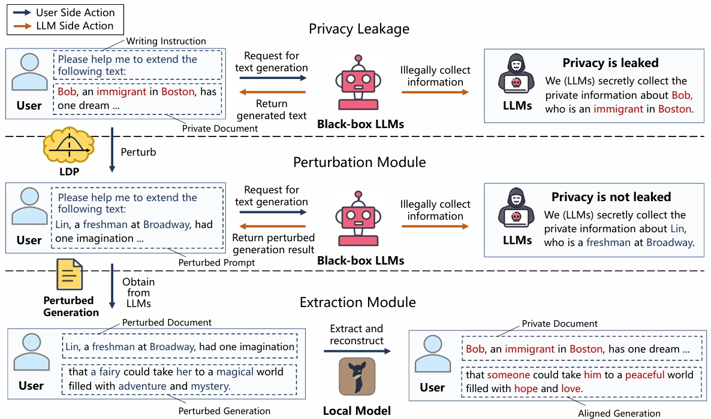

# InferDPT

Code for  "InferDPT: Privacy-preserving Inference for Black-box Large Language Models".

Note that this repo is anonymous and only intended for **review** purpose only. 

## Introduction

We propose InferDPT, the first practical framework for privacy-preserving Inference of black-box LLMs, implementing Differential Privacy in Text generation. We also propose RANTEXT, a novel differential privacy mechanism integrated into the perturbation module of InferDPT, which introduces the concept of "RANdom adjacency list" for TEXT perturbation within the prompt.

<p align="center">

</p>

## Setup Environment

### Install required packages

#### step1  Install RANTEXT

```shell
conda create -n InferDPT python=3.10
conda activate InferDPT
git clone https://github.com/mengtong0110/InferDPT
cd InferDPT
pip install -r requirements.txt
```

#### step2  [Install FastChat](https://github.com/lm-sys/FastChat)

```
pip install "fschat[model_worker,webui]"
```

#### step3  [Install GPTQ](https://github.com/qwopqwop200/GPTQ-for-LLaMa)

```
git clone https://github.com/qwopqwop200/GPTQ-for-LLaMa.git repositories/GPTQ-for-LLaMa
cd repositories/GPTQ-for-LLaMa
git switch fastest-inference-4bit
python setup_cuda.py install
pip install texttable
```
### Download embedding files

Download the embedding files from the [sharing link](https://drive.google.com/drive/folders/1mshI2yoJyx8LOLpAx7RB31VQkj-lvV1u?usp=sharing) and store them in the folder *InferDPT/data*.

We obtain embedding files of 11000 English words from the model [*text-embedding-ada-002*](https://openai.com/blog/new-and-improved-embedding-model). You can also use others embedding files.


## Privacy-preserving Inference with InferDPT

#### step1. Perturbation Module

Run the following code to get the Perturbed Generation:

```
python main.py  #You need to modify the variable to your input data (Prefix Text) and get the Perturbed Generation.
```

#### step2. Extraction Module

Deploy a model locally and use the following prompt to complete the text generation task:

```
Your task is to extend the “Prefix Text”. Use the “Perturbed Generation” as your primary writing material for your extension. Extract
coherent and consistent text from the “Perturbed Generation” and
integrate them into your continuation. Ensure a seamless alignment
with the context established by the “Prefix Text”. Provide only your
“Extended Text”
——“Prefix Text”:
——“Perturbed Generation”:
——“Extended Text”:
```

For information about model deployment, please refer to [FastChat](https://github.com/lm-sys/FastChat) and [GPTQ](https://github.com/qwopqwop200/GPTQ-for-LLaMa).